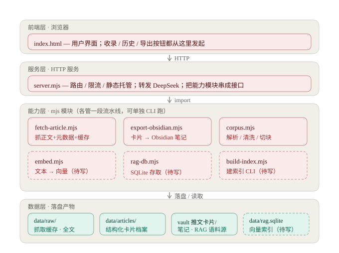

# link-vault（链藏）

贴一个链接 → 自动抓取 → AI 整理成结构化卡片 → 存档可查。
AI 产品经理训练作品 · V1（S2 阶段产物）

## 本地跑法

```powershell
cd app
node server.mjs        # 打开 http://localhost:3000
```

- 密钥放在仓库根目录 `.env`（`DEEPSEEK_API_KEY=...`），只被服务端读取，永不出现在前端
- 数据存在 `app/data/`：`raw/` 是抓取缓存（含幂等缓存 `raw/<hash>.json`），`articles/` 是结构化卡全量档案，`index.json` 是历史目录——已被 .gitignore 排除

## 架构



**一句话数据流**

```
贴链接 → index.html → server.mjs → fetch-article → DeepSeek → data/
       → export-obsidian → vault 笔记 → corpus → embed → rag-db → 可检索的索引
```

| 层 | 文件 | 职责 |
|---|---|---|
| 前端层 | `index.html` | 用户界面；收录 / 历史 / 导出都从这里发起 |
| 服务层 | `server.mjs` | 路由 / 限流 / 静态托管；转发 DeepSeek；把能力模块串成接口 |
| 能力层 | `fetch-article.mjs` | 抓正文 + 元数据 + 幂等缓存 |
| | `export-obsidian.mjs` | 卡片 → Obsidian 笔记 |
| | `corpus.mjs` | 解析 / 清洗 / 切块 |
| | `embed.mjs` | 文本 → 向量（0.6B / 1024 维） |
| | `rag-db.mjs` | SQLite 存取向量 |
| | `build-index.mjs` | 建索引 CLI（幂等） |
| 数据层 | `data/raw/` · `data/articles/` | 抓取缓存 · 结构化卡片档案 |
| | `vault …/推文卡片/` · `data/rag.sqlite` | 语料源 · 向量索引 |

**四条设计取舍**

1. **服务层只管"接客"，能力层各管一段** —— 每个能力模块能脱离服务单独跑（`node corpus.mjs` 就能验切块，不用起服务）。
2. **每个模块双身份** —— 「`node xxx.mjs` 当命令行 + `import` 当库」两种用法（D4 起定下的风格）。
3. **一段流水线一个文件** —— 采集 / 交付 / 语料 / 向量化 / 存储 / 建索引，出问题能直接定位到"哪一段坏了"。
4. **零依赖是红线** —— HTTP 用 `node:http`、SQLite 用 `node:sqlite`、抓取用内置 `fetch`，云端不用配 `npm install`。

## 部署

- **线上地址**：<https://liancang.app.workbuddy.host/>
- **部署方式**：WorkBuddy 内置发布（打包本地目录上云，Node 常驻进程跑 `npm start` → `node app/server.mjs`）；代码版本以 git 为准（`git push` 到 GitHub `ShuWen-Go/link-vault`）
- **密钥来源**：随包 `.env` 上云（发布打包整个目录，`.gitignore` 保护的是 git、不是上传包）+ **线上专用 Key**（与本地隔离，可单独作废）+ DeepSeek 预充值制（**余额即硬上限**）
- **本地 vs 云端差异**：本地目录是唯一真源，**每次发布 = 用本地状态覆盖云端**——云端运行期新入档的历史会在下次发布时被抹掉（"可写但不持久"，S2 验收只要陌生人能用，接受）；抓取幂等缓存云端同样生效
- **已知限制**：云端服务端频率限制未生效——本地六连发第 6 次正常返回 429，云端 24+ 次探测全 HTTP 200。根因两个候选（① 部署平台复用沙箱、进程未重启；② 平台反代后 `x-forwarded-for` 每请求不同 → 按 IP 计数失效），倾向 ②。当前云端防线 = 前端按钮防抖 + 线上专用 Key + 预充值余额（损失上限 = 余额）；频率限制代码保留在 `server.mjs`，换部署环境即可生效

## W3 复盘（09-26 收口，D1–D6 全部提前）

**做了什么**：D1 起仓 → D2 抓取 v0 → D3 抓取加固（六坑 + 幂等缓存）→ D4 LLM 结构化 → D5 内容层判据（quotes 核验可见化）→ D6 存历史。V1 本地全链路跑通：**贴链接 → 抓取 → AI 卡片 → 自动入库 → 历史可查**，重启数据不丢。

### 踩坑（每个都值一顿饭）

1. **贴代码贴出语法错误（D3 正则转义被吃、D6 锚点行连带删掉）**。学会的定位四板斧：① 先读懂报错本身——`SyntaxError` 类型 + `文件:行号` + `^` 指向符，Node 已把 80% 的活干了；② 报错行看不出问题就**往前看**，缺的开括号在报错行之前；③ `git diff`——刚改完就报错，改动范围就是嫌疑范围；④ `node --check` 预检、前端看 F12 Console、后端看 server 终端日志。
2. **信封层级 bug（D5）**：金句区显示"空"，但 D4 明明抽得出 5–6 条 → 数据大概率回来了，是取的姿势不对 → F12 → Network → Response 看实际传输的 JSON → `quotesCheck` 在响应顶层，前端却在 `meta.quotesCheck` 找 → 静默走兜底文案。方法论：**判据只认实际传输，不认"我以为返回了什么"；程序没崩 ≠ 数据到位**。
3. **curl 502 假象（D4）**：3000 端口没服务在听，curl 却拿到 502——请求走了系统代理，代理连不上目标就替 server 回了个错。教训：**收到报错先问"这条响应到底是谁发的"，中间层会替目标说话**。

### 三条最值钱的结论

1. **约束平时看不见效果，它保的是"模型想发挥的那一刻"**——反向实验删约束三轮零复现，说明抽取任务上模型自身偏保守；约束是下限保险不是行为开关，等更强模型、更"诱导发挥"的素材才触发。
2. **编造和改写是两种病，两道防线各管一种**——占位规则（原文没有就空数组）防编造，子串比对（逐字匹配原文）抓改写；结构 100% 合法，内容仍可能被改写，所以判据必须做到内容层。
3. **能读档就不重算**——幂等缓存和历史直读是同一个思想：重算不只费钱，还制造不一致；"要不要重算"由 hash 键判断，不靠感觉。

### W4 战果（09-27/29，S2 收口）

部署上线完成：**公网链接 + 手机 5G 全链路零报错**（新抓取 → 卡片金句逐字核验 → 历史入档）。部署适配三处改造（PORT 环境变量化 / 绑 0.0.0.0 / Key 回退环境变量）+ `package.json`。云端行为探测三个结论：data/ 可写、「发布即覆盖」、随包 `.env` 生效。见上方「部署」章节。

## RAG 索引（S3，进行中）

**已落地**

- **D1 卡片导出 Obsidian**：卡片 + 原文全文 → vault `15-参考项目/推文卡片/<标题>.md`（frontmatter / 双链 `[[推文卡片索引]]` / 全文折叠 callout）；后端 `POST /api/export` + 卡片「📤 导出到 Obsidian」按钮（**本地专属**：云端无 vault，如实报错不做假成功）
- **D2 语料与索引**：vault 笔记 → 解析（卡片 + 全文，剥 callout 前缀）→ **噪音清洗**（5 条规则，命中明细可审阅）→ **结构感知切块**（target 500 字 / overlap 回退 1 段 / 绝不切断段落）→ **Qwen3-Embedding-0.6B**（1024 维）→ SQLite
- **D2+ 批量入库与语料扩容**：`ingest.mjs`（URL 列表 → 抓取 → 结构化 → 存档 → 导出，**幂等可重跑**）；语料 **4 篇 → 14 篇 / 423 块**；知识库迁到独立仓库 **AI知识库**（`10-推文卡片/<YYYY-MM>/` + `50-MOC/` 索引）
- **D3 双路检索**：向量路（余弦，擅"意思近"）+ 关键词路（**字符 bigram 查询覆盖率**，零依赖、擅精确串）+ **RRF 融合**（按排名融合，免调权重）
- **D4 问答接口 + 三重防幻觉**：`POST /api/ask` + 前端「🔍 问一问」；防线 ① 检索锁定（prompt 只许用召回内容）② 溯源校验（代码解析 `[n]` 编号、越界即告警）③ 无匹配降级（双路阈值实测标定）

**命令（在 `app/` 下执行）**

```powershell
node ingest.mjs --file urls.txt   # 批量入库（抓取 → 结构化 → 存档 → 导出 Obsidian）
node export-obsidian.mjs --all    # 把已有档案全部导出到 vault
node build-index.mjs --check      # 切块 → 向量化 → 落库 → 相似度抽查
node retrieve.mjs                 # 三路检索对比（向量 / 关键词 / 融合）
node ask.mjs "你的问题"            # 端到端问答（含降级路径）
node corpus.mjs                   # 只看切块 / 清洗结果（零 API 消耗）
node embed.mjs "自检文本"          # embedding 连通性自检（1 条额度）
```

**关键参数与取舍**

- 语料源 = vault `10-推文卡片/` 的 **14 篇笔记**（不是 `data/raw/`——那里有只抓取未结构化的残留）
- 第 0 块是**概要块**（卡片浓缩，单独成块不参与切分）：实测未霸榜（问句 Top1 仍是全文块）
- 清洗规则：图片行 / 纯符号行 / 纯数字短行 / 推广强特征 / 文末营销语（仅文档后 25%）——**营销语用组合短语匹配**，避免子串误伤（真实踩坑：正文「我现在**在看**」曾被误删）
- 产物：`app/data/rag.sqlite`（**423 块 / 14 篇** / 1024 维）

**本地 vs 云端**

`data/` 不进 git、但**随发布打包上云** ⇒ **本地建索引、云端只查询**；云端没有 vault，重建索引不可行也不需要。环境探测：`GET /api/env` 返回 Node 版本 / `node:sqlite` 可用性 / 索引状态（SQLite 一律**动态 import**，云端版本过低时只影响该接口，不会拖垮服务启动）。

### 选型过程（经验：切块参数是怎么定的）

**问题**：公众号推文动辄上万字（最长一篇 1.7 万字），怎么切？**不猜，先用真实语料量一遍**：

| target | 2.6 千字文 | 8 千字文 | 1.7 万字文 |
|---|---|---|---|
| 300 字 | 10 块 | 16 块 | 59 块 |
| **500 字** | 6 块 | 8 块 | **34 块** |
| 800 字 | 3 块 | 5 块 | 18 块 |

**结论**：取 **500 字**。300 太碎（单块信息量低，容易召回到碎片）；800 太大（一块混 2–3 个话题，**向量被稀释**）。切块算法按**段落聚合、绝不切断段落**，块间回退 1 段做重叠。

**卡片与全文的关系**（实测对比）：混切 71 块 vs **卡片独立成"概要块" 69 块（4 概要 + 65 全文）** → 选后者。理由：卡片是全文的浓缩，混切 = 同一信息被索引两遍；且浓缩内容语义相似度天然偏高，容易**霸榜**（参考项目复盘踩过的"摘要霸榜"坑）。实测验证：问句 Top1 仍是全文块（0.8521 > 概要块 0.7449）—— **概要块存在，但不霸榜**。

**🚨 噪音清洗的教训（最有价值的一条）**：第一版规则用**单词**匹配（`在看`/`留言`/`扫码`），结果把正文「所以我**现在看** WorkBuddy…」的结论段删了 —— 单词规则里的「在看」命中了「现在看」里的「在看」，**子串误伤**。改成**组合短语**（`点个在看`/`欢迎留言`/`扫码领取`/`(限席|限量|限时)名额`）后复测：3 条命中全是真广告、正文零误删。

> 同类于「格式对齐 ≠ 内容对齐」：**字符串匹配必然误伤，关键是让规则"更整体"，而不是"更灵敏"**。所有清洗命中都有明细日志，可审阅、可回滚。

**降级阈值（实测标定，不是拍脑袋）**

| 判定 | 向量分 | 关键词分 | 行为 |
|---|---|---|---|
| 有依据 | ≥ 0.42 | 或 ≥ 0.85 | 正常作答 |
| 降级 | < 0.42 | 且 < 0.85 | 直接答"资料中没有找到相关内容"，**不调模型**（省成本 + 不硬答） |

> 标定依据（**14 篇语料二次标定**）：语料外问题向量最高 **0.387**；语料内问题 ≥ 0.44。
> 关键词路做了两件事才拦得住误判：① **bigram 覆盖率按 IDF 加权** —— 朴素覆盖率下「深圳明天的天气怎么样」拿到 0.778（"明天/天气/怎么"是通用词，语料里到处都是），加权后降到 0.698；② **阈值提到 0.85** —— 高于所有语料外样本，又不误伤精确串（「1206.6万人次」关键词 1.000）。
> 教训：**阈值不是拍的，是量出来的**；而且**语料一变就必须重标**（4 篇时的 0.60 在 14 篇语料下会漏判）。

**已知局限**

- **召回不全**：多概念查询会被"高密度概念"主导。实测问「MCP 和 Skill 是什么关系？」，召回 5 块全落在《一文讲透Skill》（该篇并无 MCP），而真正讲 MCP 的《对比 4 款 AI 工作台》未进 top-5。**模型诚实拒答、零编造（防线生效）**，但对用户而言是"答案缺失"。改进方向：多概念拆分检索 / MMR 去冗余 / 专有名词加权。
- **建索引只能在本地**：问答依赖 `data/rag.sqlite`（随发布包上云，云端可查）；但语料源在 vault，云端无法重建索引。

**评测（10 题 × 三组对照，2026-09-29）**

| 组 | 总通过 | 语料内出处正确 |
|---|---|---|
| A 无检索（基线，模型自身知识） | 0/10 | 0/8 |
| B 关键词单路 | 3/10 | 1/8 |
| **C 双路 RAG（当前实现）** | **10/10** ✅ | **8/8** |

判据 **≥8/10** → 通过。跑法：`node eval.mjs`。

三个关键发现：

1. **RAG 的必要性（0/8 → 8/8）**：无检索时模型"答得理直气壮但错" —— 把地铁客运量编成"台风影响"、把飞轮四环节编成"感知/记忆/决策/行动"。**在私有语料上，模型自身知识越丰富，错答越像真的。**
2. **双路 > 单路（1/8 → 8/8）**：单路有 7 题误降级 —— 单一判据要么松到放行噪音、要么紧到误杀真问题。**双路不只为"召回更全"，更是为了"判定更稳"。**
3. **"无匹配降级"是必需的产品机制**：语料外问题在基线组会**硬答**（认真给出红烧肉做法），模型没有"我不知道"的默认倾向，得由产品来兜。
